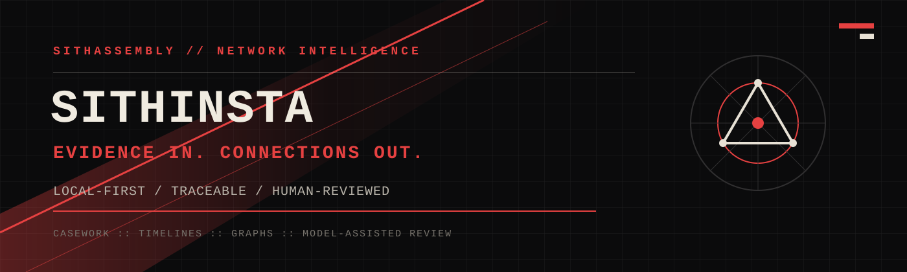
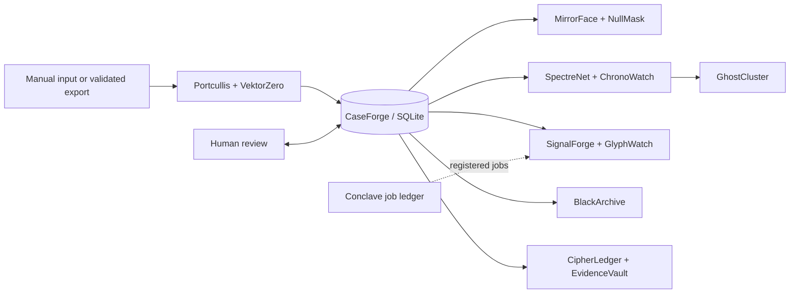

<p align="center">
  
</p>

<p align="center">
  <a href="https://github.com/Lennox9898/SithAssembly-SithInsta/wiki"></a>
  
  
  
  <a href="LICENSE"></a>
</p>

<p align="center">
  <strong>A local-first intelligence workbench for traceable social-media evidence.</strong><br>
  Map accounts, activity, relationships, timelines, and model-assisted review without turning probabilistic output into fact.
</p>

<p align="center">
  <a href="https://github.com/Lennox9898/SithAssembly-SithInsta/wiki"><strong>Explore the Wiki</strong></a>
  &nbsp;//&nbsp;
  <a href="#quick-start"><strong>Run locally</strong></a>
  &nbsp;//&nbsp;
  <a href="SECURITY.md"><strong>Security boundary</strong></a>
</p>

---

## Evidence in. Connections out.

**SithAssembly//SithInsta** turns analyst-supplied or validated exported public-content records into structured casework. It connects observations, profile changes, shared links, mentions, hashtags, repeated language, timelines, and graph relationships while preserving the source record behind each candidate.

The system is built for investigation support, not automated verdicts. Identity hypotheses, anomaly scores, graph centrality, OCR text, and model responses remain reviewable claims with confidence, provenance, and evidence links.

> **Current state:** active local alpha. The browser interface, case database, command console, review workflow, model adapters, exports, and evidence vault are implemented. Platform collection, automated account activity, external posting, and public multi-user hosting are not enabled.

## What ships today

| Capability | Current implementation |
| --- | --- |
| **Case intelligence** | Cases, observations, sources, notes, tags, screenshots, profile snapshots, identity hypotheses, and review states. |
| **Network reconstruction** | Evidence-bound relationships, common-neighbor and path analysis, communities, centrality, and source-linked graph data. |
| **Temporal analysis** | Chronological views, account activity comparison, profile-change history, and processing timelines. |
| **Local model adapters** | Optional comment anomaly scoring, PP-OCRv6 OCR, Depth Anything V2 derivatives, and loopback-only local LLM providers. |
| **Visible orchestration** | Registry-loaded modules, Conclave job state, immutable job events, processing stages, diagnostics, and redacted runtime logs. |
| **Evidence output** | Complete JSON/PDF case exports plus opt-in encrypted and signed EvidenceVault packages. |

## System map



Modules do not discover arbitrary code. Startup loads only the explicit `src.SithAssembly.*` entries in [`config/module_registry.json`](config/module_registry.json), and each external bridge remains separately configured and bounded.

## The Assembly

| Layer | Modules |
| --- | --- |
| Intake and casework | `VektorZero`, `Portcullis`, `CaseForge` |
| Profiles and identity | `MirrorFace`, `NullMask` |
| Relationships and time | `SpectreNet`, `ChronoWatch`, `GhostCluster` |
| Local analysis | `SignalForge`, `GlyphWatch`, `MindForge` |
| Coordination | `AssemblyCore`, `Conclave`, `CommandDeck`, `ClawBridge` |
| Integrity and reporting | `CipherLedger`, `BlackArchive`, `EvidenceVault` |
| Runtime and deployment | `ForgeProbe`, `Citadel` |

The complete role map lives in the [Module Overview](https://github.com/Lennox9898/SithAssembly-SithInsta/wiki/Module-Overview).

## Quick start

Requirements: Windows and Python 3.11 or newer. The base local runtime uses the Python standard library; AI backends are optional and installed separately.

```powershell
git clone https://github.com/Lennox9898/SithAssembly-SithInsta.git
cd SithAssembly-SithInsta
.\RUN.bat
```

Open `http://127.0.0.1:8080`.

Validate configuration or run the test suite without starting the server:

```powershell
python app.py --check-config
python -m unittest discover -s tests
```

Use `.\DEV.bat` for detailed local diagnostics. Optional OCR, depth, anomaly, local-LLM, container, and network setup is documented in the Wiki and is never activated silently.

## Documentation

The README is the front door. Operational detail and evolving design guidance belong in the **[Wiki](https://github.com/Lennox9898/SithAssembly-SithInsta/wiki)**:

| Start here | Deep dive |
| --- | --- |
| [Local Setup](https://github.com/Lennox9898/SithAssembly-SithInsta/wiki/Local-Setup) | [Analysis Models](https://github.com/Lennox9898/SithAssembly-SithInsta/wiki/Analysis-Models) |
| [Casework and Evidence](https://github.com/Lennox9898/SithAssembly-SithInsta/wiki/Casework-and-Evidence) | [Conclave Job Ledger](https://github.com/Lennox9898/SithAssembly-SithInsta/wiki/Conclave-Job-Ledger) |
| [Module Overview](https://github.com/Lennox9898/SithAssembly-SithInsta/wiki/Module-Overview) | [Deployment](https://github.com/Lennox9898/SithAssembly-SithInsta/wiki/Deployment) |
| [Command Console](https://github.com/Lennox9898/SithAssembly-SithInsta/wiki/Command-Console) | [Security and Trust](https://github.com/Lennox9898/SithAssembly-SithInsta/wiki/Security-and-Trust) |

Versioned contracts and reference artifacts remain in the repository:

- [`SECURITY.md`](SECURITY.md) defines the supported security boundary.
- [`AGENT_COORDINATION.md`](AGENT_COORDINATION.md) defines human-editable agent coordination rules.
- [`docs/COMMANDS.md`](docs/COMMANDS.md) is the source of truth for enabled local commands.
- [`docs/Network-Intelligence-Command-Reference.pdf`](docs/Network-Intelligence-Command-Reference.pdf) is the printable English command reference.
- [`docs/External-Stack-Evaluation-Dossier-2026-09-04.pdf`](docs/External-Stack-Evaluation-Dossier-2026-09-04.pdf) captures the English architecture evaluation snapshot.

## Trust boundary

- Every candidate should remain traceable to source material, capture time, processing method, and confidence.
- A model result is review material, never proof of identity, intent, ideology, coordination, or criminal conduct.
- The supported default is loopback-only. Network deployment requires an explicit token, Host allowlist, authenticated TLS or a private VPN, and additional production controls.
- Credentials, case evidence, databases, logs, model caches, private keys, and vault material do not belong in Git.

Read the full [security policy](SECURITY.md) before enabling any network-facing configuration.

## License

SithAssembly//SithInsta is free and open-source software licensed under the
[GNU Affero General Public License v3.0 only](LICENSE). Individuals, NGOs,
companies, and government entities may use it without a license fee or prior
permission. Modified versions may also be used, but distributing them or
offering them to users over a network requires the corresponding source code to
remain available under AGPL-3.0.

AGPL permits charging for copies or services; its protection is strong
copyleft, not a ban on commercial activity. Versions previously published
under MIT retain their original license.
